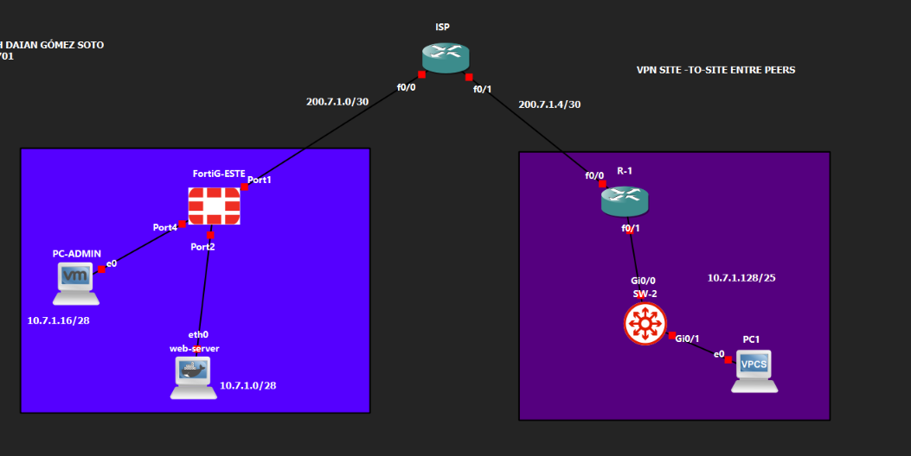
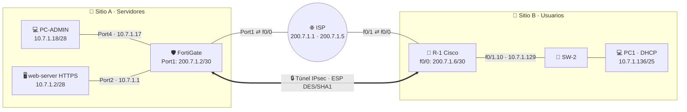
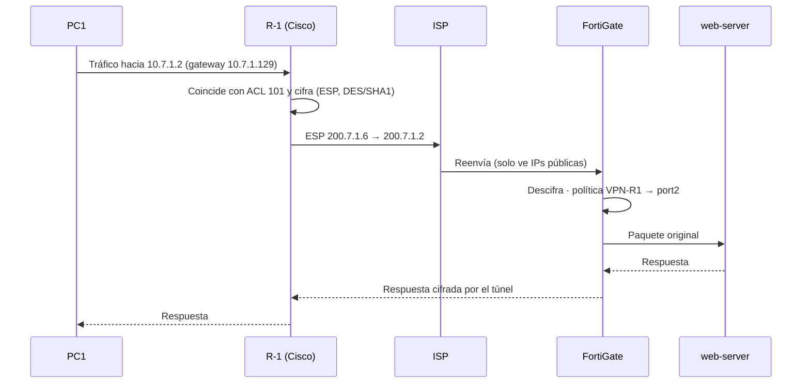
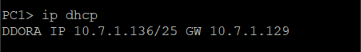
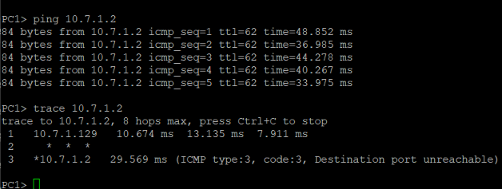
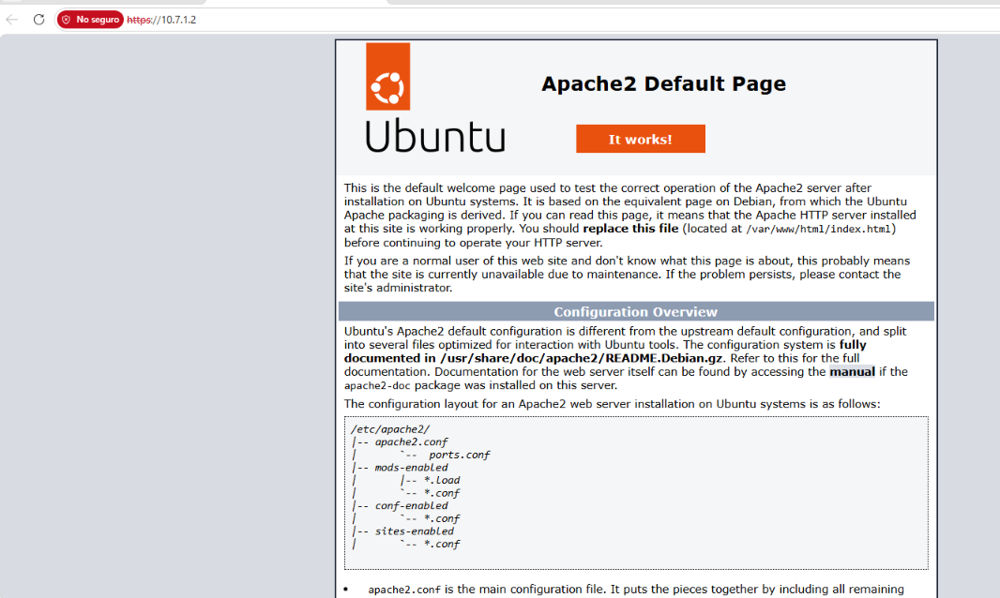
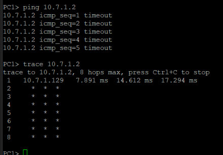

<div align="center">

# 🔐 VPN Site-to-Site IPsec entre Peers
### FortiGate (configuración por GUI) ↔ Router Cisco · Laboratorio en GNS3


**Estudiante:** Lisbeth Daian Gómez Soto &nbsp;·&nbsp; **Matrícula:** 2025-0701

</div>

---

## 🎥 Video demostrativo

<div align="center">
  <a href="https://youtu.be/bHQzuacoOBU">
    
  </a>
</div>

**▶️ Haz clic en la imagen para ver el video del laboratorio.**

</div>

---

## 📑 Tabla de contenidos

1. [Propósito del laboratorio](#-propósito-del-laboratorio)
2. [Cumplimiento de los requisitos](#-cumplimiento-de-los-requisitos)
3. [Topología](#️-topología)
4. [Direccionamiento](#-direccionamiento)
5. [Parámetros de la VPN](#-parámetros-de-la-vpn)
6. [Flujo del tráfico](#-flujo-del-tráfico)
7. [Configuración](#️-configuración)
8. [Pruebas y evidencias](#-pruebas-y-evidencias)
9. [Problemas encontrados y soluciones](#-problemas-encontrados-y-soluciones)
10. [Consideraciones de seguridad](#-consideraciones-de-seguridad)
11. [Estructura del repositorio](#-estructura-del-repositorio)

---

## 🎯 Propósito del laboratorio

Este laboratorio implementa una **VPN IPsec Site-to-Site entre dos peers de distinto fabricante**: un firewall **FortiGate** y un router **Cisco**, conectados a través de un **ISP** que solo conoce direcciones públicas.

**Objetivos**

- ✅ Comunicar a un **usuario** (PC1, VLAN 10) con un **servidor web HTTPS** a través del enlace VPN.
- ✅ Comprobar que **la comunicación solo fluye si el enlace VPN está activo**.
- ✅ Configurar el FortiGate **íntegramente por GUI**: red, NAT y VPN Site-to-Site.
- ✅ Configurar el equipo Cisco: red, DHCP, NAT y VPN Site-to-Site.
- ✅ Demostrar la conectividad con `ping`, `traceroute` y acceso HTTPS.

**Escenario:** una oficina de usuarios (Sitio B, router Cisco) necesita acceder de forma segura a un servidor web ubicado en otra sede protegida por un FortiGate (Sitio A). El tráfico entre ambas viaja cifrado por internet (ISP).

---

## ✅ Cumplimiento de los requisitos

| # | Requisito | Cómo se cumple | Evidencia |
|---|-----------|----------------|-----------|
| 1 | Comunicar al usuario con el servidor por la VPN | PC1 (`10.7.1.128/25`) llega a `10.7.1.2` a través del túnel IPsec | [Pruebas](#-pruebas-y-evidencias) |
| 2 | La comunicación solo fluye con la VPN activa | Ruta *blackhole* en el FortiGate, redes privadas no enrutadas por el ISP y NAT excluido para el tráfico VPN | [Prueba sin VPN](#4-prueba-negativa-sin-vpn-no-hay-comunicación) |
| 3 | FortiGate: todo por GUI | Rutas, objetos, VPN y políticas creados desde la interfaz web. Solo las IPs iniciales de las interfaces se asignaron por consola, para poder abrir el GUI | [docs/03](docs/03-configuracion-fortigate-gui.md) |
| 4 | FortiGate: configuración de red | Port1 (WAN), Port2 (servidor), Port4 (admin) y rutas estáticas | [Interfaces](images/fortigate-gui/05-interfaces.png) · [Rutas](images/fortigate-gui/06-rutas-estaticas.png) |
| 5 | FortiGate: NAT | Políticas hacia Port1 con NAT activado; NAT desactivado en las políticas de la VPN | [Políticas](images/fortigate-gui/08-politicas-firewall.png) |
| 6 | FortiGate: VPN Site-to-Site | Túnel `VPN-R1` con fase 1 y fase 2 | [Fase 1](images/fortigate-gui/01-ipsec-fase1-red.png) · [Fase 2](images/fortigate-gui/04-ipsec-fase2-selectores.png) |
| 7 | Equipo de red Cisco: red, NAT y VPN | Router R-1 (Cisco 2691, IOS 12.4) con sub-interfaz VLAN 10, NAT overload y crypto map | [docs/02](docs/02-configuracion-cisco.md) · [script](configs/scripts/03-r1-cisco.txt) |
| 8 | ISP con IPs públicas | Enlaces `200.7.1.0/30` y `200.7.1.4/30` | [Script ISP](configs/scripts/01-isp.txt) |
| 9 | Servidor web `/28` con HTTPS | `10.7.1.0/28`, Apache2 en el puerto 443 | [HTTPS](images/evidencias/03-https-servidor.png) |
| 10 | Usuarios `/25`, VLAN 10 y DHCP | `10.7.1.128/25` con DHCP en R-1 y trunk 802.1Q hacia SW-2 | [DHCP](images/evidencias/01-pc1-dhcp.png) |
| 11 | Traceroute hacia el servidor | `trace 10.7.1.2` desde PC1 llega al servidor | [Traceroute](images/evidencias/02-ping-traceroute-con-vpn.png) |

---

## 🧰 Equipos y versiones

| Equipo | Plataforma |
|---|---|
| FortiG-ESTE | FortiGate-VM64-KVM · FortiOS 7.0.9 |
| R-1 | Cisco 2691 · IOS 12.4(25d) |
| ISP | Cisco 2691 · IOS 12.4 |
| SW-2 | Cisco IOSv L2 · IOS 15.2 |
| web-server | Ubuntu + Apache2 (contenedor Docker en GNS3) |
| PC-ADMIN · PC1 | Equipo Windows de administración · VPCS |

---

## 🗺️ Topología

<div align="center">


*Topología implementada en GNS3.*

</div>



---

## 🌐 Direccionamiento

Las direcciones se construyeron con los últimos dígitos de la matrícula (**07·01 → 7.1**).

| Enlace / Red | Red | Equipos |
|---|---|---|
| ISP f0/0 ↔ FortiGate Port1 | `200.7.1.0/30` | ISP `.1` · FortiGate `.2` |
| ISP f0/1 ↔ R-1 f0/0 | `200.7.1.4/30` | ISP `.5` · R-1 `.6` |
| Servidor web (**/28**) | `10.7.1.0/28` | FortiGate Port2 `.1` · web-server `.2` |
| Administración (/28) | `10.7.1.16/28` | FortiGate Port4 `.17` · PC-ADMIN `.18` |
| Usuarios VLAN 10 (**/25**) | `10.7.1.128/25` | R-1 f0/1.10 `.129` · PC1 por DHCP |

**DHCP (R-1):** pool `VLAN10` · red `10.7.1.128/25` · gateway `10.7.1.129` · DNS `8.8.8.8` · excluidas `.129–.135`.

| Dispositivo | Puerto | Conectado a |
|---|---|---|
| ISP | f0/0 | FortiGate Port1 |
| ISP | f0/1 | R-1 f0/0 |
| FortiGate | Port2 | web-server eth0 |
| FortiGate | Port4 | PC-ADMIN e0 |
| R-1 | f0/1 (sub-interfaz `.10`) | SW-2 Gi0/0 (trunk) |
| SW-2 | Gi0/1 (acceso VLAN 10) | PC1 e0 |

---

## 🔧 Parámetros de la VPN

| Parámetro | FortiGate (`VPN-R1`) | Cisco R-1 |
|---|---|---|
| Peer remoto | `200.7.1.6` | `200.7.1.2` |
| IKE | IKEv1 · Main mode | IKEv1 · Main mode |
| Autenticación | Pre-shared key | Pre-shared key |
| Fase 1 | DES · SHA1 · DH 2 · 86400 s | DES · SHA1 · DH 2 · 86400 s |
| Fase 2 | DES · SHA1 · PFS DH 2 · 3600 s | `esp-des esp-sha-hmac` · PFS group 2 · 3600 s |
| Selector local | `10.7.1.0/28` | `10.7.1.128/25` (ACL 101) |
| Selector remoto | `10.7.1.128/25` | `10.7.1.0/28` (ACL 101) |
| NAT Traversal | Deshabilitado | — |

> Los selectores de ambos peers son **espejo exacto** uno del otro.

---

## 🔄 Flujo del tráfico



**Por qué solo funciona con la VPN activa**

1. El ISP no tiene rutas hacia las redes `10.7.1.x`; el tráfico privado nunca se enruta por internet.
2. El FortiGate tiene una **ruta blackhole** (distancia 254) hacia `10.7.1.128/25`; si el túnel cae, el tráfico se descarta.
3. El tráfico entre ambas redes está **excluido del NAT** (ACL 100 en R-1; NAT desactivado en las políticas VPN del FortiGate).

---

## ⚙️ Configuración

| Documento | Contenido |
|---|---|
| 📘 [docs/01-topologia-y-direccionamiento.md](docs/01-topologia-y-direccionamiento.md) | Dispositivos, enlaces y plan de direccionamiento |
| 📗 [docs/02-configuracion-cisco.md](docs/02-configuracion-cisco.md) | ISP, SW-2 y R-1 paso a paso |
| 📙 [docs/03-configuracion-fortigate-gui.md](docs/03-configuracion-fortigate-gui.md) | FortiGate por GUI con capturas |
| 📕 [docs/04-pruebas-y-verificacion.md](docs/04-pruebas-y-verificacion.md) | Pruebas, resultados esperados y traceroute |
| 📓 [docs/05-problemas-y-soluciones.md](docs/05-problemas-y-soluciones.md) | Problemas reales y cómo se resolvieron |
| 📸 [docs/06-checklist-de-capturas.md](docs/06-checklist-de-capturas.md) | Capturas del laboratorio |

**Scripts utilizados** (`configs/scripts/`)

| Script | Equipo |
|---|---|
| [01-isp.txt](configs/scripts/01-isp.txt) | ISP |
| [02-sw2.txt](configs/scripts/02-sw2.txt) | SW-2 |
| [03-r1-cisco.txt](configs/scripts/03-r1-cisco.txt) | R-1 (red, DHCP, NAT, VPN) |
| [04-fortigate-bootstrap-consola.txt](configs/scripts/04-fortigate-bootstrap-consola.txt) | FortiGate: IPs iniciales por consola |
| [05-web-server.txt](configs/scripts/05-web-server.txt) | Servidor web |
| [06-equipos-finales.txt](configs/scripts/06-equipos-finales.txt) | PC1 y PC-ADMIN |
| [07-verificacion.txt](configs/scripts/07-verificacion.txt) | Comandos de verificación |

**Running-config** (`configs/running-config/`): [ISP](configs/running-config/ISP.txt) · [SW-2](configs/running-config/SW-2.txt) · [R-1](configs/running-config/R-1.txt) · [FortiGate](configs/running-config/FortiGate.txt) *(extracto del laboratorio)*

> Las contraseñas y los hashes de los equipos fueron ocultados en los scripts y en las running-config.

### 🛡️ Configuración del FortiGate por GUI

<table>
<tr>
<td align="center"><b>Interfaces</b><br></td>
<td align="center"><b>Rutas estáticas</b><br></td>
</tr>
<tr>
<td align="center"><b>Objetos de dirección</b><br></td>
<td align="center"><b>Políticas de firewall</b><br></td>
</tr>
<tr>
<td align="center"><b>VPN · Fase 1 (red)</b><br></td>
<td align="center"><b>VPN · Fase 1 (propuesta)</b><br></td>
</tr>
<tr>
<td align="center"><b>VPN · Autenticación</b><br></td>
<td align="center"><b>VPN · Fase 2 (selectores)</b><br></td>
</tr>
</table>

---

## 🧪 Pruebas y evidencias

### 1. DHCP en los usuarios (VLAN 10)



PC1 recibe `10.7.1.136/25` con gateway `10.7.1.129`.

### 2. Conectividad y traceroute con la VPN activa



- El `ping` al servidor responde con `ttl=62` (dos saltos de enrutamiento: R-1 y FortiGate).
- El `trace` muestra: salto 1 → R-1 (`10.7.1.129`); salto 2 → FortiGate (no responde a TTL expirado, por eso `* * *`); salto 3 → **servidor `10.7.1.2`**. El mensaje *Destination port unreachable* lo envía el propio servidor y es la forma normal en que termina un traceroute: indica que se **llegó al destino**.

### 3. Acceso HTTPS al servidor



### 4. Prueba negativa: sin VPN no hay comunicación



Con la VPN deshabilitada, el `ping` expira y el `trace` no pasa del primer salto. Al reactivar el túnel, la comunicación se restablece.

### 5. Túnel activo en el FortiGate


Fase 1 y fase 2 del túnel `VPN-R1` en verde (Up).

### 6. Verificación en el router Cisco

```text
R-1# show crypto isakmp sa
dst             src             state          conn-id slot status
200.7.1.6       200.7.1.2       QM_IDLE              1    0 ACTIVE

R-1# show crypto ipsec sa | include pkts
    #pkts encaps: 5, #pkts encrypt: 5, #pkts digest: 5
    #pkts decaps: 5, #pkts decrypt: 5, #pkts verify: 5
```

`QM_IDLE` confirma la fase 1; los contadores `encaps` y `decaps` suben juntos, por lo que el tráfico viaja cifrado en ambos sentidos.

---

## 🔒 Consideraciones de seguridad

- **DES** se usó porque el FortiGate del laboratorio no ofrecía AES. DES es un cifrado débil y obsoleto; en producción se usaría **AES-256 con SHA-256 y DH 14 o superior**.
- IKEv1 en modo Main con **clave precompartida**; en producción conviene IKEv2 y certificados.
- La clave precompartida de este repositorio es solo de laboratorio.
- Se recomienda desactivar el acceso administrativo **HTTP** en Port4 y dejar solo HTTPS y SSH.
- En el R-1 la clave precompartida aparece en texto claro en la configuración (`crypto isakmp key`); en producción se cifra con `service password-encryption` o se usan certificados.
- Las contraseñas de acceso a los equipos no se publican; los scripts usan `<CONTRASEÑA>` como marcador.

---

## 📁 Estructura del repositorio

```text
.
├── README.md
├── docs/
│   ├── 01-topologia-y-direccionamiento.md
│   ├── 02-configuracion-cisco.md
│   ├── 03-configuracion-fortigate-gui.md
│   ├── 04-pruebas-y-verificacion.md
│   ├── 05-problemas-y-soluciones.md
│   └── 06-checklist-de-capturas.md
├── configs/
│   ├── scripts/            # Scripts usados en la práctica
│   └── running-config/     # Configuraciones finales de cada equipo
└── images/
    ├── topologia/          # Diagrama de la topología
    ├── fortigate-gui/      # Capturas de la configuración por GUI
    ├── cisco/              # Capturas de los equipos Cisco
    └── evidencias/         # Pruebas de funcionamiento
```

---

<div align="center">

Hecho con ☕ y mucha paciencia por **Lisbeth Daian Gómez Soto** · 2025-0701

</div>
