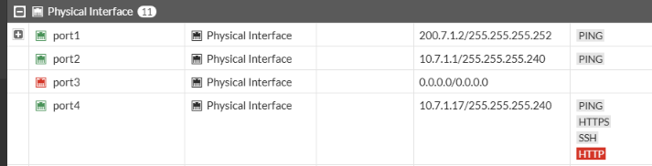
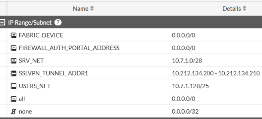
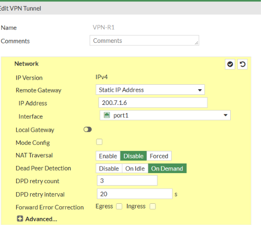
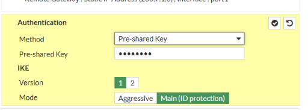
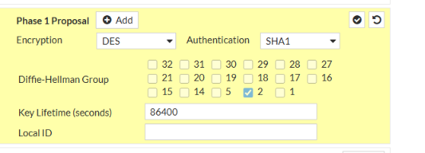
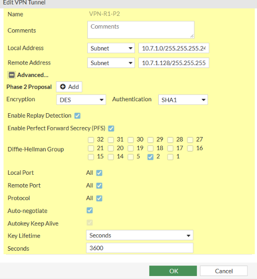
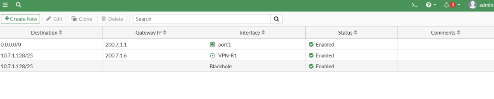
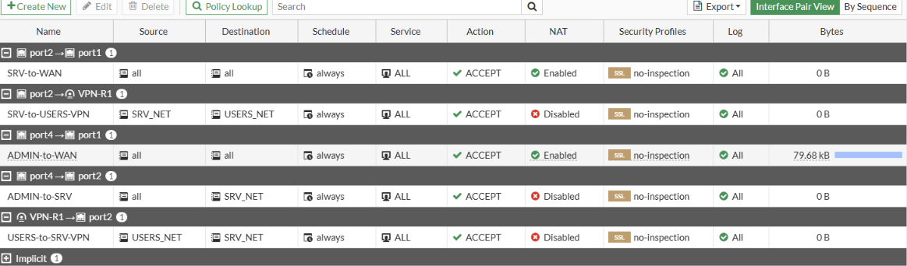
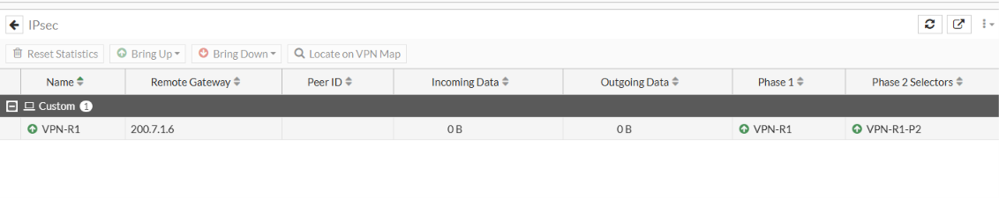

# 📙 Configuración del FortiGate por GUI

[⬅️ Volver al README](../README.md)

**Plataforma:** FortiGate-VM64-KVM · FortiOS 7.0.9.

## 0. Acceso inicial al GUI

Un FortiGate recién iniciado en GNS3 no tiene IP en Port4, así que **solo para poder abrir el GUI** se asignaron por consola las IPs de las interfaces y el acceso administrativo (script [`04-fortigate-bootstrap-consola.txt`](../configs/scripts/04-fortigate-bootstrap-consola.txt)). A partir de ahí, **todo lo demás se configuró por GUI** desde **PC-ADMIN** en `https://10.7.1.17` (Port4): rutas, objetos, VPN y políticas.

> Orden recomendado: interfaces → ruta por defecto → objetos → túnel VPN → rutas de la VPN → políticas.

## 1. Interfaces — *Network → Interfaces*

| Interfaz | IP | Rol | Acceso administrativo |
|---|---|---|---|
| port1 | `200.7.1.2/30` | WAN (hacia ISP) | PING |
| port2 | `10.7.1.1/28` | LAN (servidor) | PING |
| port4 | `10.7.1.17/28` | LAN (administración) | PING · HTTPS · SSH · HTTP |

## 2. Objetos de dirección — *Policy & Objects → Addresses*

| Nombre | Subred |
|---|---|
| `SRV_NET` | `10.7.1.0/28` |
| `USERS_NET` | `10.7.1.128/25` |

## 3. Túnel VPN — *VPN → IPsec Tunnels → Create New → Custom*

### 3.1 Red

- Nombre: `VPN-R1`
- Remote Gateway: **Static IP Address** `200.7.1.6`
- Interfaz: `port1`
- NAT Traversal: **Disable**
- Dead Peer Detection: On Demand

### 3.2 Autenticación

- Método: Pre-shared Key
- IKE versión **1**, modo **Main (ID protection)**

### 3.3 Fase 1

- Encryption **DES** · Authentication **SHA1**
- Diffie-Hellman Group **2**
- Key Lifetime **86400** s

### 3.4 Fase 2

- Nombre: `VPN-R1-P2`
- Local Address: `10.7.1.0/255.255.255.240`
- Remote Address: `10.7.1.128/255.255.255.128`
- Encryption **DES** · Authentication **SHA1**
- PFS habilitado · DH Group **2**
- Auto-negotiate habilitado · Key Lifetime **3600** s

## 4. Rutas estáticas — *Network → Static Routes*

| Destino | Salida | Distancia | Función |
|---|---|---|---|
| `0.0.0.0/0` | port1 · gateway `200.7.1.1` | por defecto | Salida a internet |
| `10.7.1.128/25` | `VPN-R1` | 10 | Tráfico hacia los usuarios por el túnel |
| `10.7.1.128/25` | **Blackhole** | 254 | Si el túnel cae, el tráfico se descarta |

La ruta *blackhole* garantiza que **la comunicación solo fluya con la VPN activa**.

## 5. Políticas de firewall — *Policy & Objects → Firewall Policy*

| ID | Nombre | Entrada → Salida | Origen → Destino | Servicio | NAT |
|---|---|---|---|---|---|
| 1 | `SRV-to-USERS-VPN` | port2 → VPN-R1 | SRV_NET → USERS_NET | ALL | **Desactivado** |
| 2 | `USERS-to-SRV-VPN` | VPN-R1 → port2 | USERS_NET → SRV_NET | ALL | **Desactivado** |
| 3 | `ADMIN-to-WAN` | port4 → port1 | all → all | ALL | **Activado** |
| 4 | `SRV-to-WAN` | port2 → port1 | all → all | ALL | **Activado** |
| 5 | `ADMIN-to-SRV` | port4 → port2 | all → SRV_NET | ALL | Desactivado |

> En esta versión del FortiGate cada política admite **una sola interfaz de entrada**, por eso hay una política por interfaz.

## 6. Verificación del túnel — *Monitor → IPsec Monitor*

Fase 1 y fase 2 en verde indican que el túnel está activo. Para forzar la negociación se usa **Bring Up**.
